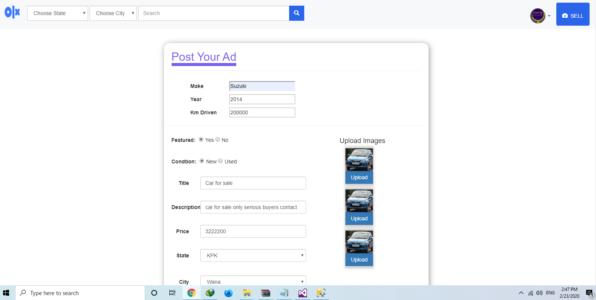
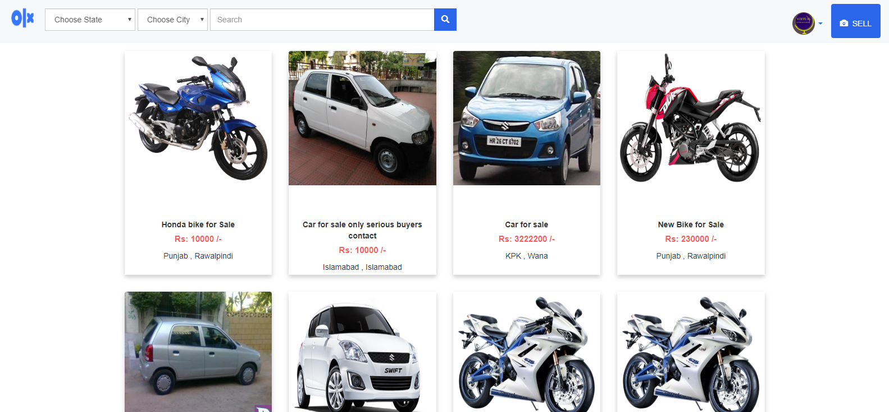
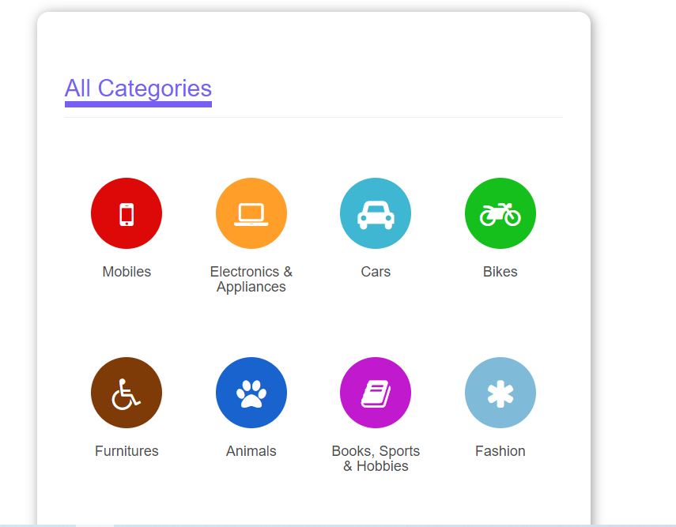
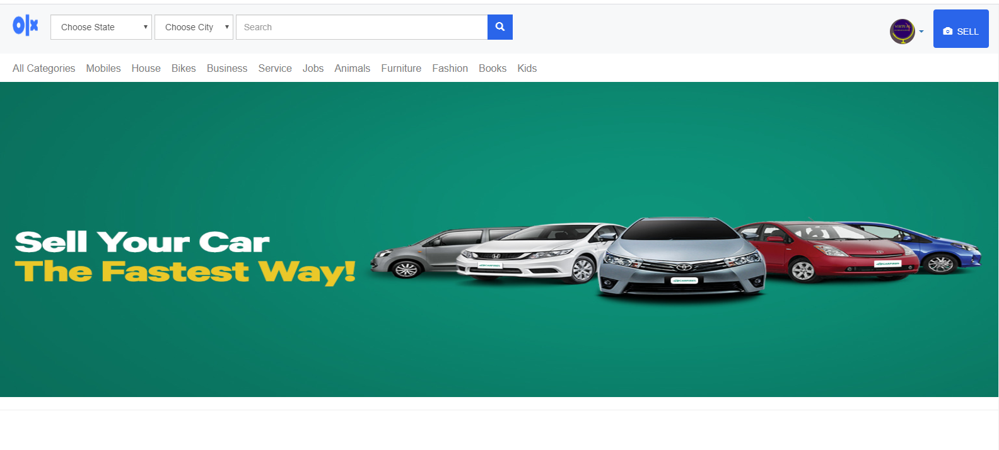
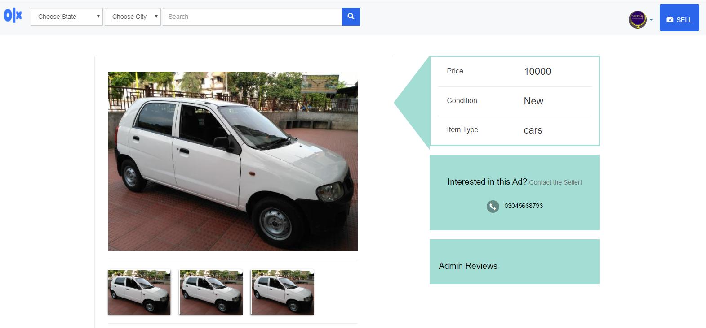
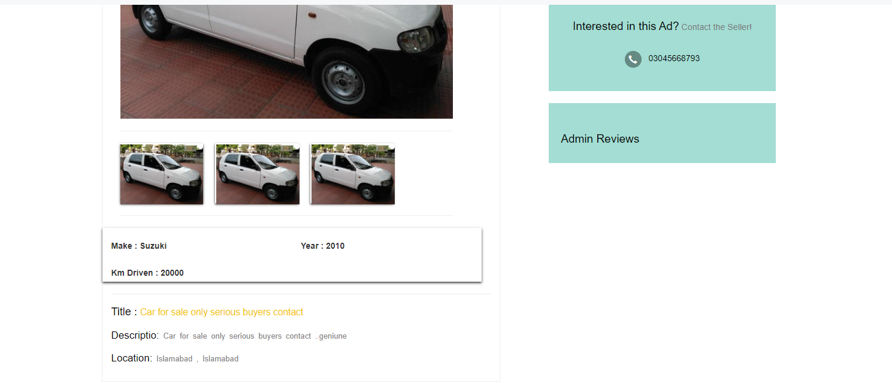
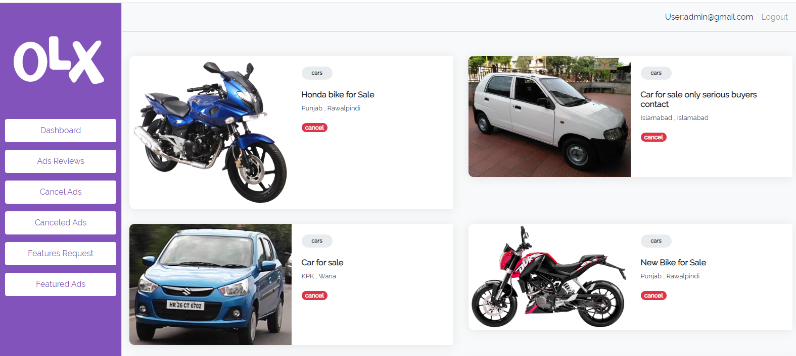

# Olx-Largest-buy-and-sell-website--Replica
Project description
✅  User Panel
1. Sign In
2. Sign Up (Email Verification also)
3. Post Ad (with image, description, price, cell number)
4. User can view other user’s ad
5. User will be notified if ad posting was unsuccessful
6. Filter/Search (name(flexible),price)

✅ Admin Panel
1. Sign In (Predefined user)
2. Reviews ad (whether ad should be displayed or not e.g. successful or unsuccessful)
3. Make ads to feature in featured list on user’s choice

✅ - Image 1

✅ - Image 2

✅ - Image 3

✅ -Image 4

✅ -Image 5

✅ - Image 6

✅ - Image 7

